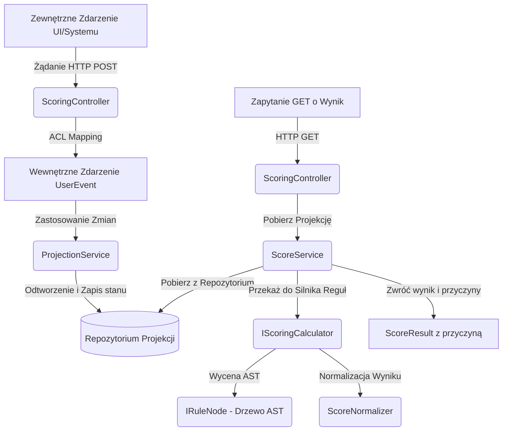

# Model Scoringu Preferencji Użytkownika — Dokumentacja Techniczna

Niniejszy dokument opisuje architekturę, mechanizmy działania oraz strukturę implementacji modułu scoringowego w systemie **Szlakomat**. Rozwiązanie zostało zaprojektowane zgodnie z zasadami Domain-Driven Design (DDD) oraz wzorcami projektowymi, zapewniając elastyczność, rozszerzalność i odporność na zmiany w innych modułach.

---

## 1. Cel Biznesowy i Założenia

Głównym celem modułu scoringowego jest dynamiczne wyliczanie wskaźnika dopasowania danej kategorii atrakcji (szlaku) do preferencji konkretnego użytkownika. 
- **Wynik**: Wartość z przedziału `[0.0, 1.0]` (wartość rozmyta).
- **Zastosowanie**: Sortowanie rekomendacji, personalizacja interfejsu użytkownika, dynamiczne kolejkowanie atrakcji.

---

## 2. Architektura i Przepływ Danych (Data Flow)

Architektura opiera się na czterech głównych etapach:
1. **Dane wejściowe (Events) & Warstwa ACL (Anti-Corruption Layer)**
2. **Przetwarzanie (Projections)**
3. **Silnik Reguł (AST & Fuzzy Logic)**
4. **API i Wyjście (Integration)**



---

## 3. Szczegółowy Opis Komponentów

### 3.1. Zdarzenia i Warstwa ACL (Anti-Corruption Layer)
System rejestruje zachowania użytkownika i mapuje je za pomocą serwisu mapującego na wewnętrzny model zdarzeń. Dzięki temu zmiany w innych domenach (np. e-commerce czy obsługa zgłoszeń) nie wpływają na logikę wyliczania punktacji.

*   **Klasa reprezentująca zdarzenie**: [UserEvent](source/Szlakomat.Scoring.Domain/Events/UserEvent.cs) definiowane przez enum [EventType](source/Szlakomat.Scoring.Domain/Events/EventType.cs).
*   **Podział zdarzeń**:
    *   *Pozytywne*: `Click`, `Purchase`, `HighRating`.
    *   *Negatywne*: `Skip`, `LowRating`.
*   **Wartość Category**: Opakowana w Value Object [TrailCategory](source/Szlakomat.Scoring.Domain/ValueObjects/TrailCategory.cs), co zapewnia spójność reguł biznesowych (DDD).

---

### 3.2. Projekcje i Okna Czasowe
Zamiast analizować całą bazę zdarzeń przy każdym zapytaniu, system opiera się na z góry zagregowanym stanie użytkownika w postaci projekcji [UserCategoryProjection](source/Szlakomat.Scoring.Domain/Projections/UserCategoryProjection.cs).

*   **Pola projekcji**:
    *   `RecentClicks` (kliknięcia z ostatnich 30 dni)
    *   `HistoryPurchases` (zakupy z ostatnich 90 dni)
    *   `RecentSkips` (pominięcia z ostatnich 30 dni)
    *   `AverageRating` (średnia ocena kategorii wyliczana dynamicznie ze zdarzeń ocen wysokich i niskich)
*   **DDD - Enkapsulacja i Hydracja**:
    Projekcja chroni swój stan – ma prywatne settery. Jej stan jest modyfikowany wyłącznie przez wewnętrzną metodę `Apply(UserEvent, bool)` lub odtwarzany z bazy danych przy użyciu wzorca fabryki statycznej `Restore(...)` (tzw. *Hydration Pattern*).

---

### 3.3. Silnik Reguł AST (Abstract Syntax Tree)
Reguły decyzyjne nie są zapisane jako kaskada warunków `if-else`. Zamiast tego są modelowane jako hierarchiczne drzewo wyrażeń. Pozwala to na pełną zmianę logiki biznesowej bez modyfikacji kodu ewaluatora.

*   **Wspólny interfejs**: Wszystkie węzły drzewa implementują interfejs [IRuleNode](source/Szlakomat.Scoring.Domain/Rules/IRuleNode.cs).
*   **Węzły logiczne (Composite Pattern)**:
    *   [AndNode](source/Szlakomat.Scoring.Domain/Rules/Composite/AndNode.cs) — Fuzzy AND (zwraca minimum ze swoich dzieci).
    *   [OrNode](source/Szlakomat.Scoring.Domain/Rules/Composite/OrNode.cs) — Fuzzy OR (zwraca maksimum ze swoich dzieci).
    *   [NotNode](source/Szlakomat.Scoring.Domain/Rules/Composite/NotNode.cs) — Odwrócenie logiczne (wartość `1.0 - x`).
    *   [IfThenNode](source/Szlakomat.Scoring.Domain/Rules/Composite/IfThenNode.cs) — Warunek progowy logiczny.
    *   [WeightedNode](source/Szlakomat.Scoring.Domain/Rules/Composite/WeightedNode.cs) — Średnia ważona z podwęzłów (np. nadanie zakupom większej wagi niż kliknięciom).
*   **Liście (Leaf Nodes / Metryki)**:
    Węzły pobierające surowe wartości z projekcji i normalizujące je do przedziału `[0, 1]`:
    *   [FuzzyClicksNode](source/Szlakomat.Scoring.Domain/Fuzzy/Nodes/FuzzyClicksNode.cs)
    *   [FuzzyPurchasesNode](source/Szlakomat.Scoring.Domain/Fuzzy/Nodes/FuzzyPurchasesNode.cs)
    *   [FuzzySkipsNode](source/Szlakomat.Scoring.Domain/Fuzzy/Nodes/FuzzySkipsNode.cs)
    *   [FuzzyRatingNode](source/Szlakomat.Scoring.Domain/Fuzzy/Nodes/FuzzyRatingNode.cs)

---

### 3.4. Algebra Rozmyta (Fuzzy Logic) i Wyjaśniająca (Explained Algebra)
Silnik wspiera niezależność algebry obliczeniowej od struktury reguł:

*   **Fuzzy Algebra**: Implementowana przez [FuzzyScoreAlgebra](source/Szlakomat.Scoring.Domain/Fuzzy/FuzzyScoreAlgebra.cs) bazującą na interfejsie [IScoreAlgebra](source/Szlakomat.Scoring.Domain/Fuzzy/IScoreAlgebra.cs). Przekształca ostre progi logiczne w płynne funkcje przynależności.
*   **Explained Algebra**: System nie zwraca wyłącznie suchego wyniku liczbowego, lecz wzbogaca go o listę szczegółowych wyjaśnień (struktura [ScoreResult](source/Szlakomat.Scoring.Domain/Explanation/ScoreResult.cs)). Daje to przejrzystość działania systemu (wyjaśnialna sztuczna inteligencja - XAI).

---

### 3.5. Integracja i Usunięcie CQRS/MediatR
W toku refaktoryzacji zrezygnowano z biblioteki MediatR (CQRS) wewnątrz modułu scoringowego na rzecz bezpośredniego wstrzykiwania serwisów:
- Eliminacja narzutu pamięciowego i trudności w śledzeniu kodu (debugowaniu).
- Bezpośrednia komunikacja: `Controller -> Service -> Strategy Calculator`.
- Rejestracja zależności odbywa się w pliku [Program.cs](source/Szlakomat.Scoring.Api/Program.cs).

---

## 4. Wyjście API i Integracja

Moduł udostępnia dwa punkty dostępowe w [ScoringController](source/Szlakomat.Scoring.Api/Controllers/ScoringController.cs):

### 1. Rejestracja nowego zdarzenia
*   **Endpoint**: `POST /api/scoring/events`
*   **Body**:
    ```json
    {
      "userId": "3fa85f64-5717-4562-b3fc-2c963f66afa6",
      "category": "Góry",
      "type": "Click"
    }
    ```
*   **Działanie**: Zdarzenie przechodzi przez ACL, jest mapowane, a następnie [ProjectionService](source/Szlakomat.Scoring.Application/Services/ProjectionService.cs) inkrementuje odpowiednie wartości w repozytorium [IProjectionRepository](source/Szlakomat.Scoring.Domain/Repositories/IProjectionRepository.cs).

### 2. Pobranie scoringu i wyjaśnienia
*   **Endpoint**: `GET /api/scoring/{userId}/{category}`
*   **Działanie**: Pobiera zagregowaną projekcję, aplikuje drzewo reguł przy użyciu [FuzzyAstScoringCalculator](source/Szlakomat.Scoring.Domain/Scoring/FuzzyAstScoringCalculator.cs), a następnie zwraca znormalizowany wynik z uzasadnieniem.
*   **Response**:
    ```json
    {
      "score": 0.825,
      "reasons": [
        "Score computed from activity: 8 recent clicks, 3 historical purchases, 1 recent skips.",
        "Average category rating: 4.50."
      ]
    }
    ```
